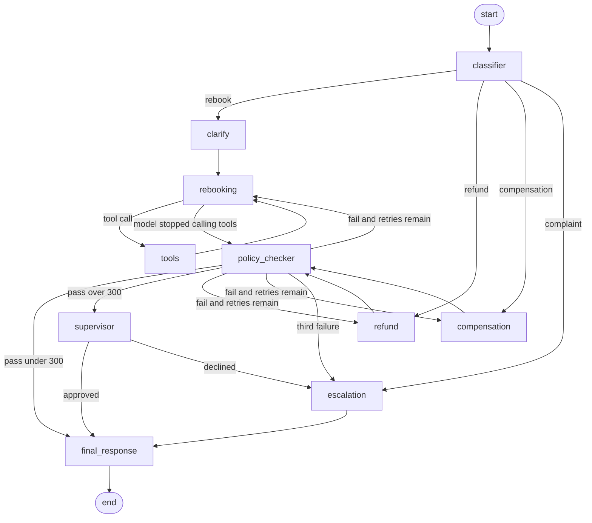

# Flight Disruption Rebooking Assistant

A passenger whose flight was cancelled or delayed sends a message. A LangGraph workflow classifies what they need, asks a specialist for one solution, checks that solution against airline policy, and writes a reply. The same conversation can continue on a `thread_id`.

```bash
python -m venv .venv
source .venv/bin/activate
pip install -r requirements.txt
cp .env.example .env   # set GEMINI_API_KEY
python -m flight_assistant.scenarios
```

That command runs all four scenarios and the follow-up, prints the path and the reply for each, and writes `scenario_output.md` plus a fresh `graph.mmd`.

The desk clock is fixed at **2026-09-29T12:00:00+00:00**, so "tomorrow noon" is 2026-09-30T12:00:00+00:00 and the 48-hour rebooking window is stable.

## Graph

Ten nodes, four conditional routers, and one retry cycle. Solid arrows always run. Dashed arrows are conditional.



`graph.mmd` is the literal text from `graph.get_graph().draw_mermaid()`. On the rebooking node, `tools_condition` returns `"tools"` or `"__end__"`. `"__end__"` means the model made no tool call, and that branch is mapped to `policy_checker` so the graph continues.

## What each node does

| Node | Responsibility |
| --- | --- |
| `classifier` | Structured output: `rebook`, `refund`, `compensation`, or `complaint`, plus any deadline. Starts a new attempt and loads any saved seat preference. |
| `clarify` | For a rebooking with no deadline, pauses with `interrupt()` and asks when the passenger needs to arrive. |
| `rebooking` | Tool-calling model. Chooses `get_booking` and `search_flights`, then proposes one flight number from the results. |
| `tools` | `ToolNode` executes the tool calls and appends the results to the message history. |
| `refund` | Reads the booking and fare rules, then proposes a refund amount. |
| `compensation` | Reads the booking and the delay, then proposes a compensation amount. |
| `policy_checker` | Plain Python. Accepts or rejects the proposal and records the reason. No model call. |
| `supervisor` | Pauses with `interrupt()` when a refund or compensation over $300 passed policy. |
| `escalation` | Writes a handover note: the request, what was tried, and why it stopped. |
| `final_response` | Writes the passenger reply: what was arranged, the next step, and whether a person will follow up. |

The classifier is the start of every turn, including a follow-up. It keeps the booking and the message history, and it clears the previous attempt (solution, policy result, retry count, escalation flag) so the new message is judged on its own.

## State

`RebookingState` is a `TypedDict`.

| Field | Who writes it | Role |
| --- | --- | --- |
| `messages` | Every node, via the `add_messages` reducer | Passenger messages, tool calls, tool results, policy feedback, and replies |
| `request_id`, `booking_ref` | Graph input | Identity for this case. A follow-up does not send them again |
| `passenger_request`, `intent`, `constraints` | Classifier | Latest ask, intent, and deadline |
| `booking`, `search_results` | Rebooking agent, after tool results | Booking and the flights that were actually returned |
| `fare_rules` | Refund agent | Refundable flag and tax amount |
| `proposed_solution`, `solution_source` | The specialist that just ran | The offer, and which node to return to if policy rejects it |
| `policy_checked`, `policy_passed`, `policy_reason` | Policy checker | Result and the failure text sent back to the specialist |
| `attempts` | Policy checker appends; classifier resets | What was tried on this turn |
| `retry_count` | Policy checker increments on failure; classifier resets | Ends the cycle |
| `escalated`, `escalation_note` | Escalation agent | Handover for a human |
| `final_response` | Final response agent | Text the passenger sees |

## Routing

1. **After the classifier.** `rebook` goes to `clarify`, then the rebooking agent. `refund` and `compensation` go to their agents. `complaint` goes straight to escalation.
2. **After rebooking.** `tools_condition` sends tool calls to `tools`, which always returns to `rebooking`. A reply with no tool call goes to the policy checker. A cap of four tool results on the same attempt forces a proposal so this loop cannot run forever.
3. **After the policy checker.** A pass under $300 goes to the final response. A refund or compensation over $300 goes to the supervisor. A failure increments `retry_count` and returns to `solution_source` (`rebooking`, `refund`, or `compensation`) with the reason on the message list. At `retry_count == 3` (the original try plus two retries) the case goes to escalation, then the final response.
4. **After the supervisor.** An approval goes to the final response. A decline goes to escalation.

The retry cycle is `specialist → policy_checker → specialist`. The counter is what guarantees it ends.

## Policy

Checked only in `flight_assistant/policy.py`.

| Request | Rule |
| --- | --- |
| Rebook | Same cabin or lower, departure inside 48 hours of the desk clock, and at least 60 minutes if there is a connection. The flight number must be one that `search_flights` returned. |
| Refund | Airline cancelled: full fare (`fare_amount`). Passenger choice on a non-refundable fare: taxes only. A refundable fare: full fare. |
| Compensation | Under 3 hours: $0. 3 to 6 hours, including exactly 6: $200. Over 6 hours, or a cancellation: $400. |

## Tools

All three are mocks. They return the same JSON on every run.

| Tool | Used by | Returns |
| --- | --- | --- |
| `get_booking(booking_ref)` | Rebooking loop, refund agent, compensation agent | Passenger, route, cabin, fare, disruption |
| `search_flights(origin, destination, date)` | Rebooking loop | Flights with times, cabin, and connections. `date` is accepted; the schedule does not change |
| `get_fare_rules(fare_type)` | Refund agent | Refundable or not, and the tax amount |

`LHR → DXB` includes flights that break a rule (business cabin `BA880`, 40-minute connection `LH441`, departure outside 48 hours `QR510`) and one that passes (`EK202`, economy, arrives 11:25). `CDG → JFK` is business class only, so an economy booking fails the cabin rule every time.

| Booking | Passenger | Case |
| --- | --- | --- |
| `XK9L2P` | Amira Hassan, LHR–DXB, economy, saver, airline cancelled, fare 850 | Scenario 1 and the refund follow-up |
| `DL6H01` | Noah Keller, delayed 6 hours | Scenario 2, compensation 200 |
| `BZ3CLS` | Sofia Martins, CDG–JFK, economy, airline cancelled | Scenario 3, business class only |
| `CMP004` | Daniel Okonkwo | Scenario 4, complaint |

## Checkpointer

Every `invoke` / `stream` call passes `configurable.thread_id`. Scenario 1 and the follow-up share `passenger-xk9l2p`. The follow-up input is only the new message. The booking reference, booking, and earlier messages stay in the checkpoint, so the refund agent does not ask for the reference again.

`python -m flight_assistant.scenarios` compiles the graph with `SqliteSaver` and writes `checkpoints.sqlite`. A later process that opens the same file can load that thread. Tests use `MemorySaver` so each run starts empty. Delete `checkpoints.sqlite` to reset the saved desk.

## Bonus behavior

- A rebooking with no deadline and no phrase such as "next flight" pauses with `interrupt()` and asks what time the passenger needs to arrive.
- A refund or compensation over $300 pauses with `interrupt()` until a supervisor approves. The scenario command approves so those turns still finish. A decline goes to escalation.
- A LangGraph store remembers an aisle or window request under the booking reference and loads it on a later thread.
- `search_flights` fans out with `Send`, one branch per airline, and merges the lists.
- The scenario report prints rebooking success rate, escalation rate, and requests by intent.

## Scenarios

| # | Message | Expected path |
| --- | --- | --- |
| 1 | Cancelled flight, in Dubai by tomorrow noon | Classifier → Rebooking ⇄ Tools → Policy checker (pass) → Final response. Flight `EK202`. |
| 1b | "Actually, can I get a refund instead?" on the same thread | Classifier → Refund → Policy checker (pass) → Supervisor approves the $850 refund → Final response. |
| 2 | Delayed 6 hours, asking about entitlement | Classifier → Compensation → Policy checker (pass) → Final response. Amount 200. |
| 3 | Rebook when only business class exists | Classifier → Rebooking ⇄ Policy checker, three failures → Escalation → Final response. |
| 4 | Third cancellation, wants a manager | Classifier → Escalation → Final response. |

With pytest installed, `python -m pytest` runs the policy rules and the same five turns against a scripted model, so routing can be checked without an API key. The graded transcript is the scenario command above, which uses the real model.
